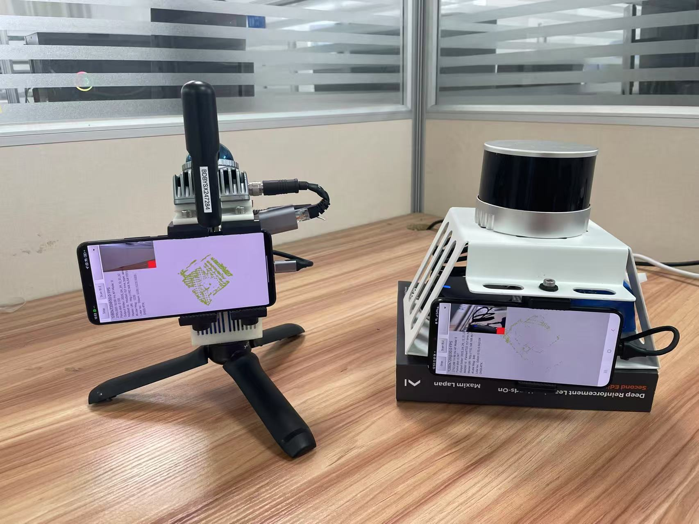
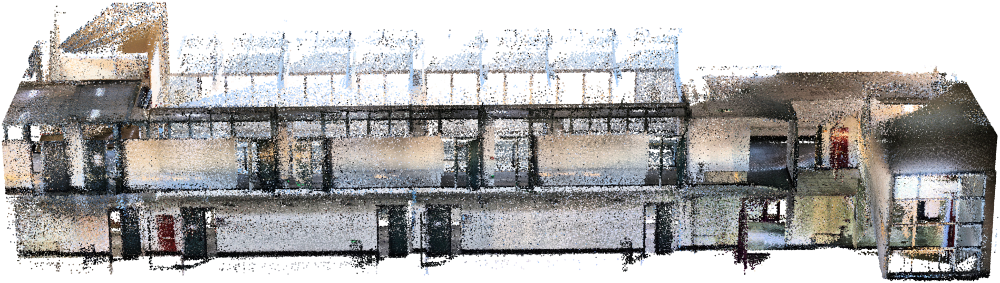
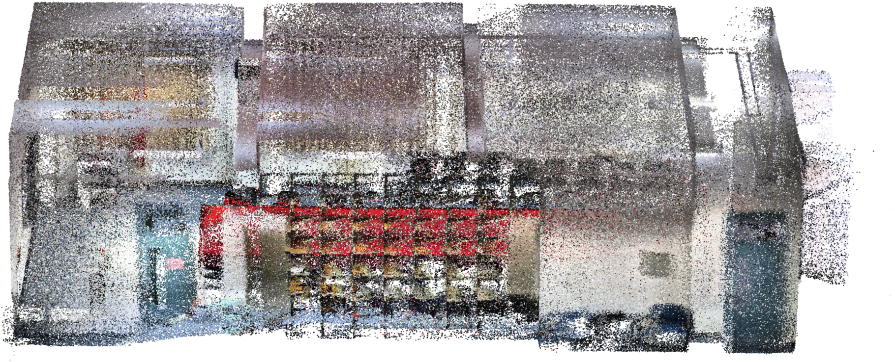
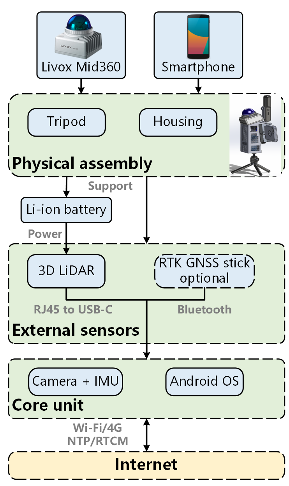

# LidarDroid

LidarDroid is a conceptual combination of a 3D LiDAR sensor and an Android smartphone.  
With a low-cost 3D LiDAR sensor and an RTK-GNSS receiver, it can serve as a low-cost mobile mapping system that creates colored point clouds by fusing Android camera imagery with LiDAR point clouds.

Our method has been evaluated with various sensor setups and in different scenarios.

  

  

  

This branch provides the source code of the Android app running on the smartphone. It supports the combination of either:

- a Livox Mid360 LiDAR and an Android smartphone, or
- a Hesai PandarXT32 LiDAR and an Android smartphone.

# Build and Install

If you do not need to modify the source code, you can skip the build step and directly install the [released Android APK](https://github.com/OSUPCVLab/marslogger_android/releases/tag/v2.1).

## Requirements

- A computer with Android Studio installed
- An Android smartphone running Android OS 11 or later
- The `mid360-rearcam-mapper` branch of `marslogger`

## Steps

1. Build the `v8a` branch of `roscpp_android` as described in the [roscpp_android README](https://github.com/JzHuai0108/roscpp_android/tree/v8a).

2. Using the generated ROS libraries, build this app following the instructions in [AndroidSensors](https://github.com/JzHuai0108/AndroidSensors/tree/mid360_rearcam).

   `AndroidSensors` is an example app that demonstrates how to develop Android apps using the ROS libraries. This app is developed in a similar manner.

As of commit `dbfc82c41c30fe13f70be3476260a7bee25e60aa`, the release APK is approximately 154 MB, and the debug APK is approximately 160 MB.

For building the `main` or `develop` branches of `marslogger`, refer to the [marslogger wiki](https://github.com/OSUPCVLab/mobile-ar-sensor-logger).

# Assemble the Sensor Rig: Mid360 Example

## Bill of Materials

- A battery with 12 V output
- A Livox Mid360 LiDAR
- A Mid360 connector with an RJ45 Ethernet connector and a barrel power connector
- An Android smartphone running Android OS 11 or later
- A USB Type-C to RJ45 Ethernet adapter
- A 3D-printed [battery housing](doc/stl/mid360_holder.STL) and [lid](doc/stl/mid360_holder_lid.STL)

## Connection

The following figure shows the sensor and power connections.

  

## Setup

1. Connect the Ethernet cable of the LiDAR to a USB Ethernet adapter with a Type-C connector, and then connect the adapter to the Android phone.

2. Enable Ethernet sharing on the Android phone in the system settings.  
   This option is available on the Redmi K40Pro phone, K60Pro phone, Samsung S22+ phone, and S9+ tablet.

3. Connect the Android phone and the computer running Android Studio to the same wireless network for debugging.

4. Enable wireless debugging on the Android phone.

5. Find the Ethernet subnet of the Android phone, for example `192.168.47.xx`, by running `ifconfig` in an ADB shell.

6. Set the subnet for the Mid360 in the configuration panel of Livox Viewer.

7. After configuration, UDP packets from the LiDAR can be received through socket say `54301`.

8. To parse these packets, compile Livox SDK2 with the Android NDK, and use JNI to call the socket connection and packet parsing functions. We have done this in the above Build step.

9. To publish these messages in ROS 1, use `roscpp_android` to compile `livox_ros_driver2`, and call the corresponding functions through JNI.
We have done this in the above Build step.

In this setup, the Android phone runs a simulated `roscore`, publishes the LiDAR point clouds, and the phone app processes and visualizes the point clouds.

## A intro video is available at [youtube](https://youtu.be/hVk2zT3KKJg).

# References

1. Thanks to the open-source program [AndroidSensors](https://github.com/eborghi10/AndroidSensors), which connects Android sensors to ROS 1 nodes using `rosjava`.

2. [What are the steps to use a Livox LiDAR with an Android phone?](https://stackoverflow.com/questions/77343278/what-are-the-steps-to-use-a-livox-lidar-with-an-android-phone) documents one of our early exploration steps.

3. Huai, J., Shao, Y., Zhang, Y., and Yilmaz, A.: A Low-Cost Portable Lidar-based Mobile Mapping System on an Android Smartphone, *ISPRS Ann. Photogramm. Remote Sens. Spatial Inf. Sci.*, X-G-2025, 375–381, https://doi.org/10.5194/isprs-annals-X-G-2025-375-2025, 2025.