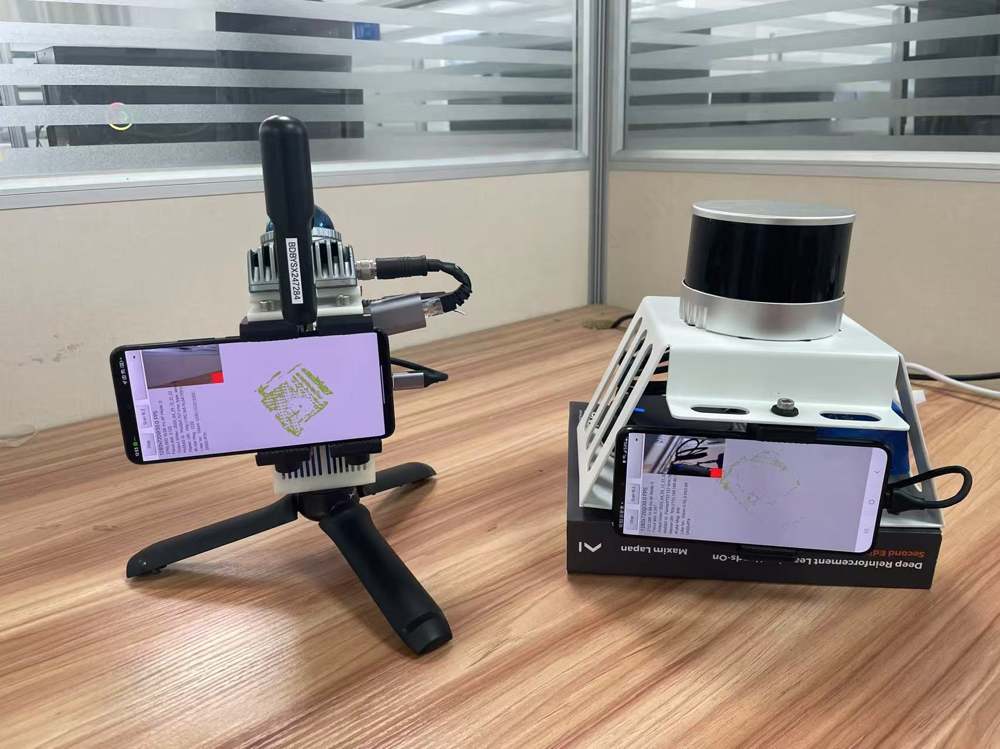
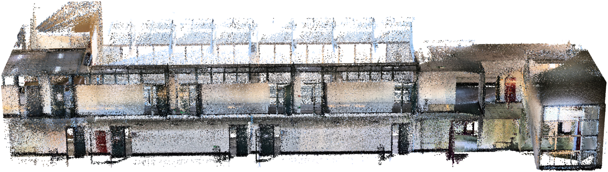
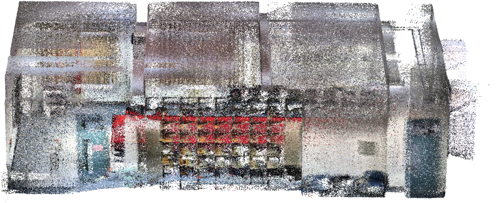
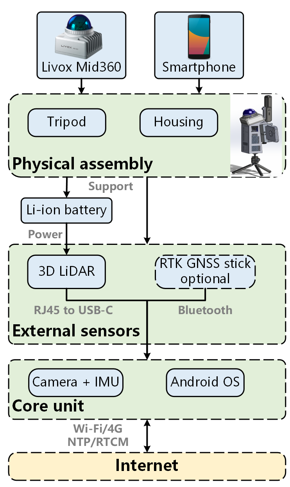

# LidarDroid

LidarDroid is a conceptual combination of a 3D LiDAR sensor and an Android smartphone.  
With a low-cost 3D LiDAR sensor and an RTK-GNSS receiver, it can serve as a low-cost mobile mapping system that creates colored point clouds by fusing Android camera imagery with LiDAR point clouds.

Our method has been evaluated with various sensor setups and in different scenarios.

  

  

  

This branch provides the source code of the Android app running on the smartphone. It supports the combination of either:

- a Livox Mid360 LiDAR and an Android smartphone, or
- a Hesai PandarXT32 LiDAR and an Android smartphone.

# Optional ARCore recording

In Settings, enable **Record ARCore camera pose** before opening the camera or LiDAR capture screen. 
This requires an ARCore-supported device with Google Play Services for AR installed and the selected camera matching ARCore's camera. 
If ARCore cannot share that camera, the app reports the issue and continues its normal Camera2/IMU/LiDAR recording.

Each recording session writes `arcore_poses.csv` beside `movie.mp4`, `movie_metadata.csv`, and `gyro_accel.csv` when ARCore starts successfully.
Each row contains the Android camera timestamp in nanoseconds, tracking state, camera translation and quaternion, 
and unrotated CPU-image intrinsics and dimensions. 
`timestamp_ns` uses the Camera2 `CaptureResult.SENSOR_TIMESTAMP` clock. `movie_metadata.csv` converts that timestamp to uptime seconds, so do not compare those columns directly; 
consult `edge_epochs.txt` for the camera clock source when aligning with IMU data. 
`world_origin_id` changes if the activity pauses and ARCore creates a new world origin during the same recording. 
Pose values are meaningful when `tracking_state` is `TRACKING`.

For offline rolling-shutter reconstruction, `movie_metadata.csv` also records the selected
logical/physical camera IDs, the physical camera's active and pre-correction array rectangles,
pixel-array size, per-frame crop rectangle, sensor orientation, lens facing, device orientation,
and camera/preview dimensions. `frame_texture_transforms.csv` records the 4x4
`SurfaceTexture` transform actually used for every frame submitted to the encoder, keyed by the
Camera2 sensor timestamp in nanoseconds, together with the encoded dimensions. Join it to
`frame_timestamps.txt` by timestamp to restrict processing to frames present in `movie.mp4`.

To check it on a device, record while moving the phone through a textured, well-lit area. 
After stopping, confirm `arcore_poses.csv` has rows with increasing timestamps and `TRACKING` states, 
and that the usual video, Camera2 metadata, and IMU files are still present.
Repeat with the setting off to confirm no ARCore CSV is created.

On the LiDAR capture screen, the red LiDAR odometry line and cyan aligned ARCore line
are drawn over the sliding-window point cloud in the LiDAR mapping frame. The app
uses the CAD `L_T_C` pose for an optical camera frame (+X right, +Y down, +Z toward
the scene). ARCore `Camera.getPose()` uses +X right, +Y up, and -Z toward the scene,
so the alignment first rotates the camera frame 180 degrees about X. It calibrates
the LiDAR sensor clock against Android receipt timestamps, matches a LiDAR and ARCore
pose within 20 ms, and then keeps `Wl_T_Wc` fixed for that ARCore world origin.
The status label shows whether alignment is waiting or initialized. Each initialized
transform, its matched timestamps, and both camera-frame extrinsics are saved to
`alignment.yaml` and `arcore_lidar_alignment.txt` in the recording session. A new
ARCore world origin requires a new one-time match. The LiDAR line assumes
`/Odometry` and `/cloud_registered` use the same mapping frame, and that the
`/Odometry` child pose is the LiDAR frame `L`. The display keeps up to 4,096 positions per
path at approximately 5 cm spacing; recording files are unchanged apart from the
alignment metadata.
The global display overlay accumulates 20 cm voxel centroids from
`/cloud_registered`; it is separate from Faster-LIO's native registration map.

# Performance benchmark files

Enable **Benchmark logging** in Settings before starting a recording. Each new camera
or LiDAR recording then writes `benchmark/pipeline_perf_*.csv` and
`benchmark/device_stats_*.csv` inside that recording's session directory. Stopping
the recording stops benchmark logging. Exporting the session includes these files.
Benchmark files from older app versions in the former shared `benchmarks` directory
remain there and are not attached to a recording automatically.

# Export recording data

After stopping a recording, open Settings and tap **Export Recording Data**.
Choose **Latest session** or a dated session, then select the phone's **Documents** folder in the Android folder picker.
MarsLogger copies the complete session to `Documents/MarsLogger/<session>/`;
selecting another folder creates `MarsLogger/<session>/` there instead.
Recordings left unfinished are omitted from the list.
Existing exports are kept, with a numbered folder name for a repeat export.
Keep the app open until the progress dialog reports completion.
The original recording stays in app-private storage.

# Build and Install

If you do not need to modify the source code, you can skip the build step and directly install the [released Android APK](https://github.com/OSUPCVLab/marslogger_android/releases/tag/v2.1).

## Requirements

- A computer with Android Studio installed
- An Android smartphone running Android OS 11 or later
- The `mid360-rearcam-mapper` branch of `marslogger`

## Steps

1. Build the `v8a` branch of `roscpp_android` as described in the [roscpp_android README](https://github.com/JzHuai0108/roscpp_android/tree/v8a).

2. Using the generated ROS libraries, build this app following the instructions in [AndroidSensors](https://github.com/JzHuai0108/AndroidSensors/tree/mid360_rearcam).

   `AndroidSensors` is an example app that demonstrates how to develop Android apps using the ROS libraries. This app is developed in a similar manner.

As of commit `dbfc82c41c30fe13f70be3476260a7bee25e60aa`, the release APK is approximately 154 MB, and the debug APK is approximately 160 MB.

For building the `main` or `develop` branches of `marslogger`, refer to the [marslogger wiki](https://github.com/OSUPCVLab/mobile-ar-sensor-logger).

# Assemble the Sensor Rig: Mid360 Example

## Bill of Materials

- A battery with 12 V output
- An inline power switch on the 12 V supply to the LiDAR
- A Livox Mid360 LiDAR
- A Mid360 connector with an RJ45 Ethernet connector and a barrel power connector
- An Android smartphone running Android OS 11 or later
- A USB Type-C to RJ45 Ethernet adapter
- A 3D-printed [battery housing](doc/stl/mid360_holder.STL) and [lid](doc/stl/mid360_holder_lid.STL)
- Two clamps that hold the smartphone rigidly against the housing

## Connection

The following figure shows the main sensor and power connections.
The inline switch is on the 12 V battery-to-LiDAR lead; the simplified
diagram does not depict it. Secure the phone with both clamps before
recording so its pose relative to the LiDAR remains fixed.

  

## Setup

1. Connect the Ethernet cable of the LiDAR to a USB Ethernet adapter with a Type-C connector, and then connect the adapter to the Android phone.

2. Enable Ethernet sharing on the Android phone in the system settings.  
   This option is available on the Redmi K40Pro phone, K60Pro phone, Samsung S22+ phone, and S9+ tablet.

3. Connect the Android phone and the computer running Android Studio to the same wireless network for debugging.

4. Enable wireless debugging on the Android phone.

5. Find the Ethernet subnet of the Android phone, for example `192.168.47.xx`, by running `ifconfig` in an ADB shell.

6. Set the subnet for the Mid360 in the configuration panel of Livox Viewer.

7. After configuration, UDP packets from the LiDAR can be received through socket say `54301`.

8. To parse these packets, compile Livox SDK2 with the Android NDK, and use JNI to call the socket connection and packet parsing functions. We have done this in the above Build step.

9. To publish these messages in ROS 1, use `roscpp_android` to compile `livox_ros_driver2`, and call the corresponding functions through JNI.
We have done this in the above Build step.

In this setup, the Android phone runs a simulated `roscore`, publishes the LiDAR point clouds, and the phone app processes and visualizes the point clouds.

## A intro video is available at [youtube](https://youtu.be/hVk2zT3KKJg).

# References

1. Thanks to the open-source program [AndroidSensors](https://github.com/eborghi10/AndroidSensors), which connects Android sensors to ROS 1 nodes using `rosjava`.

2. [What are the steps to use a Livox LiDAR with an Android phone?](https://stackoverflow.com/questions/77343278/what-are-the-steps-to-use-a-livox-lidar-with-an-android-phone) documents one of our early exploration steps.

3. Huai, J., Shao, Y., Zhang, Y., and Yilmaz, A.: A Low-Cost Portable Lidar-based Mobile Mapping System on an Android Smartphone, *ISPRS Ann. Photogramm. Remote Sens. Spatial Inf. Sci.*, X-G-2025, 375–381, https://doi.org/10.5194/isprs-annals-X-G-2025-375-2025, 2025.
